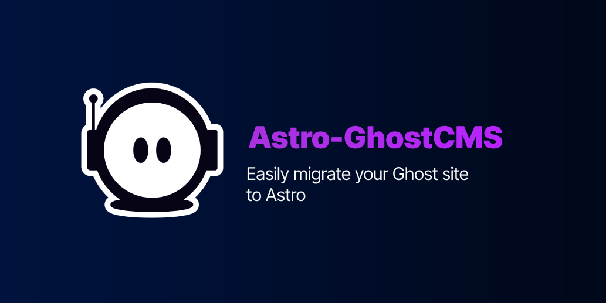

import { LinkCard, CardGrid, Aside } from '@astrojs/starlight/components';

<CardGrid>
	<LinkCard
        title="Live Demo"
        href="https://demo.astro-ghostcms.xyz/"
        description="Live Demo if the Astro-GhostCMS integration in action"
    />
    <LinkCard 
        title="Live Demo's Repo"
        href="https://github.com/MatthiesenXYZ/astro-ghostcms/tree/main/demo"
        description="GitHub Repo for the Live Demo, to show how simple our setups are!"
    />
</CardGrid>

<Aside type="caution" title="Warning">Astro minimum Version: **Astro v4.0**</Aside>

This Integration is 2 parts.  Firstly, there is the API portion that uses the `@tsghost/core-api` to create the link between astro and GhostCMS.  From there we move to the Second Part, which is a theme pre-programmed to pull ALL of its data from GhostCMS iteself instead of storing any data locally outside of Build.

- If you are looking for a more Customizable option please check the [Templates](intro/api-mode/templates/) page. 
- The default theme is not setup for SSR in Integration mode.  As such is will most likely not function properly in that mode. You will need to build your own project around the API or customize the *basetheme* linked above.