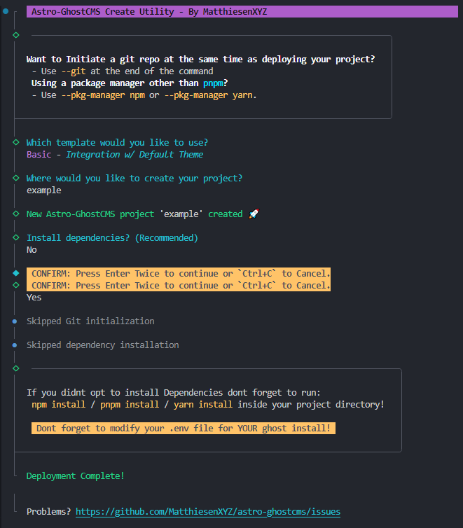

import { Aside, Tabs, TabItem } from '@astrojs/starlight/components';



<Tabs>
  <TabItem label="npm" icon="seti:npm">
```sh title="Simple"
# Run this command and follow the prompt!
npx @matthiesenxyz/create-astro-ghostcms
# Want to pass arguments through to the command?  YOU CAN!
#  `--install`     : Sets Install Dependencies to 'true'
#  `--git`         : Initiates git Repo
#  `--pkg-manager` : Specify your Package manager(i.e. npm, yarn | DEFAULT: pnpm)
```

```sh title="Advanced"
npx @matthiesenxyz/create-astro-ghostcms <template> <project_directory> --git --install
```
  </TabItem>

  <TabItem label="pnpm" icon="pnpm">
```sh title="Simple"
# Run this command and follow the prompt!
pnpm dlx @matthiesenxyz/create-astro-ghostcms
# Want to pass arguments through to the command?  YOU CAN!
#  `--install`     : Sets Install Dependencies to 'true'
#  `--git`         : Initiates git Repo
#  `--pkg-manager` : Specify your Package manager(i.e. npm, yarn | DEFAULT: pnpm)
```

```sh title="Advanced"
pnpm dlx @matthiesenxyz/create-astro-ghostcms <template> <project_directory> --git --install
```
  </TabItem>

  <TabItem label="yarn" icon="seti:yarn">
```sh title="Simple"
# Run this command and follow the prompt!
yarn dlx @matthiesenxyz/create-astro-ghostcms
# Want to pass arguments through to the command?  YOU CAN!
#  `--install`     : Sets Install Dependencies to 'true'
#  `--git`         : Initiates git Repo
#  `--pkg-manager` : Specify your Package manager(i.e. npm, yarn | DEFAULT: pnpm)
```

```sh title="Advanced"
yarn dlx @matthiesenxyz/create-astro-ghostcms <template> <project_directory> --git --install
```
  </TabItem>

</Tabs>

<Aside>
***When you deploy your install dont forget to set your ENVIRONMENT VARIABLES!***
</Aside>

## Created Routes

The routes are the same as a standard Ghost Blog so you can migrate to Astro easily.

| Route                 | Content                                   |
| --------------------- | ----------------------------------------- |
| `/`                   | Homepage with recents/features Blog Posts |
| `/404`                | 404 Page                                  |
| `/[slug]`             | Post or Page                              |
| `/author/[slug]`      | Author page with related posts            |
| `/authors`            | All the authors                           |
| `/tag[slug]`          | Tag page with related posts               |
| `/tags`               | All the tags                              |
| `/archives/[...page]` | All the posts, paginated                  |
| `/rss.xml`            | All the posts, in a FEED                  |